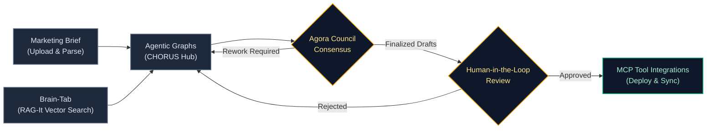
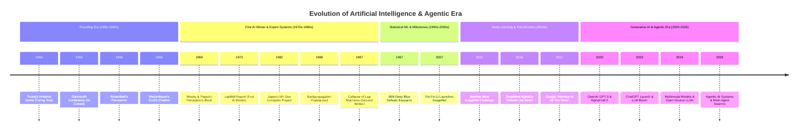
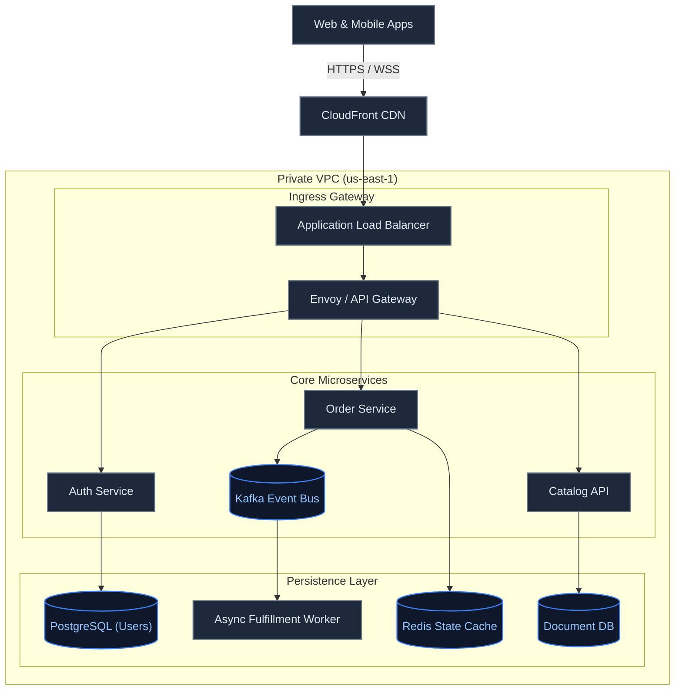
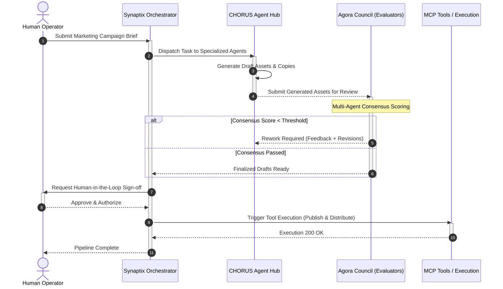
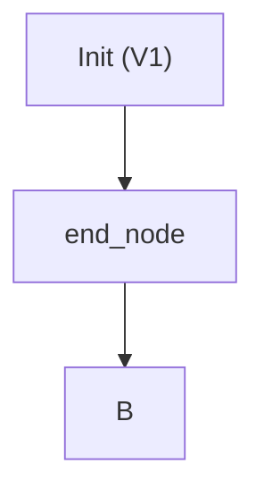

# Synaptix Diagram Architect (`synaptix-diagram-architect`)

> **Enterprise-grade Mermaid diagram architect, AST validator, and self-healing repair engine.**

Designed for AI agents, developers, and architectural teams who need rock-solid, publication-ready Mermaid diagrams without brittle syntax failures or parsing deadlocks.

---

## 🌟 Highlights

- **Pre-Flight AST & Security Validation:** Catches 99% of common LLM syntax bugs (unquoted special characters, bare `end` keywords, single `%` comments, XSS vectors) before diagrams reach the renderer.
- **One-Shot Auto-Repair (`--fix`):** Deterministically auto-quotes labels, renames reserved keyword collisions, and fixes syntax flaws in place.
- **Zero External Dependencies:** Built with pure Python standard library (`re`, `argparse`, `json`). Runs anywhere from local CLI to containerized agent sandboxes.
- **Synaptix Editorial Standards:** Curated aesthetics, responsive direction choices, compact decision diamonds, and clean logical subgraph boundaries.

---

## 🎨 Production Visualizations (Real Examples)

GitHub natively renders each of these production diagrams below:

### 1. Autonomous Agent Workflow with Agora Council & HITL Gate
*A live orchestration pipeline showing intake, RAG vector lookup, agent collaboration, multi-agent evaluation council, and human-in-the-loop verification:*



---

### 2. Evolution of AI & Agentic Era Timeline (1950 – 2026)
*An executive chronological milestone roadmap spanning the founding era through modern multi-agent systems:*



---

### 3. Distributed Cloud Microservices & Streaming Architecture
*A production cloud topology with edge routing, isolated private VPC boundaries, Kafka event streaming, and polyglot persistence:*



---

### 4. Multi-Agent Governance & Deliberation Protocol
*Sequence protocol demonstrating autonomous agent task handoffs, deliberation consensus scoring, and human validation:*



---

## 🚀 Quickstart

### 1. Validate Mermaid DSL
```bash
python3 scripts/validate_mermaid.py --code "flowchart TD
  client[\"Client Application\"] --> gateway[\"API Gateway\"]
"
```

### 2. Auto-Repair Broken Syntax
```bash
python3 scripts/validate_mermaid.py --code "flowchart TD
  A[Init (V1)] --> end --> B
" --fix
```

**Output:**


### 3. Machine-Readable JSON Output (for AI Tool Calling)
```bash
python3 scripts/validate_mermaid.py --code "flowchart TD\n  A --> B" --json
```

```json
{
  "valid": true,
  "diagram_type": "flowchart",
  "errors": [],
  "warnings": [],
  "line_count": 2
}
```

---

## 📁 Skill Structure

```text
synaptix-diagram-architect/
├── SKILL.md                 # Agent instructions, rules, patterns & reference guides
├── README.md                # Public documentation & usage instructions
└── scripts/
    └── validate_mermaid.py  # Executable CLI AST validator & repair engine
```

---

## 🛠️ Supported Diagram Types

- **Flowcharts (`flowchart TD / LR`):** System architectures, microservices, data ingestion DAGs.
- **Sequence Diagrams (`sequenceDiagram`):** API handshakes, auth flows, event loops.
- **Timelines (`timeline`):** Engineering roadmaps, historical eras, and release schedules.
- **State Diagrams (`stateDiagram-v2`):** Entity lifecycles, circuit breakers, worker queues.
- **Entity Relationship (`erDiagram`):** Database schemas, foreign keys, cardinality.
- **Quadrant Matrices (`quadrantChart`):** 2x2 prioritization & risk matrices.
- **Sankey Diagrams (`sankey-beta`):** Multi-stage traffic, cost, or resource flows.

---

## 📜 License
MIT License. Created by **Synaptix**.
