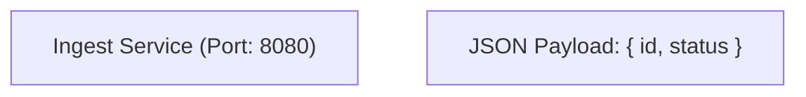
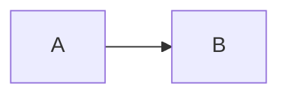
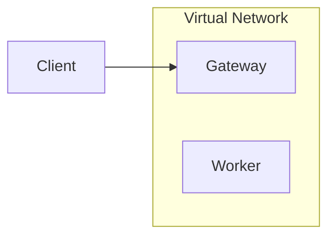
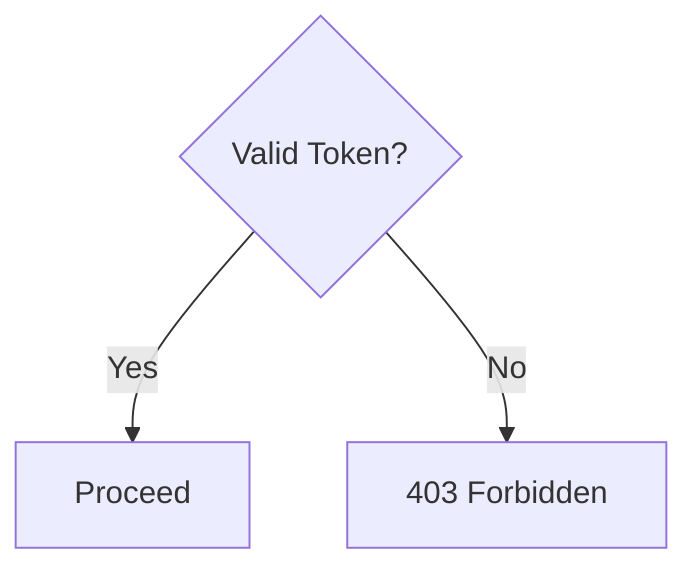
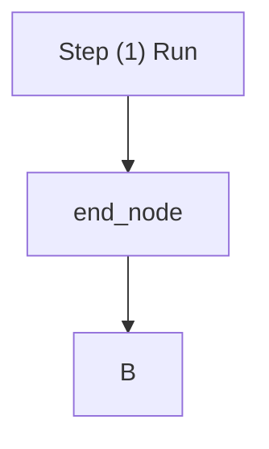
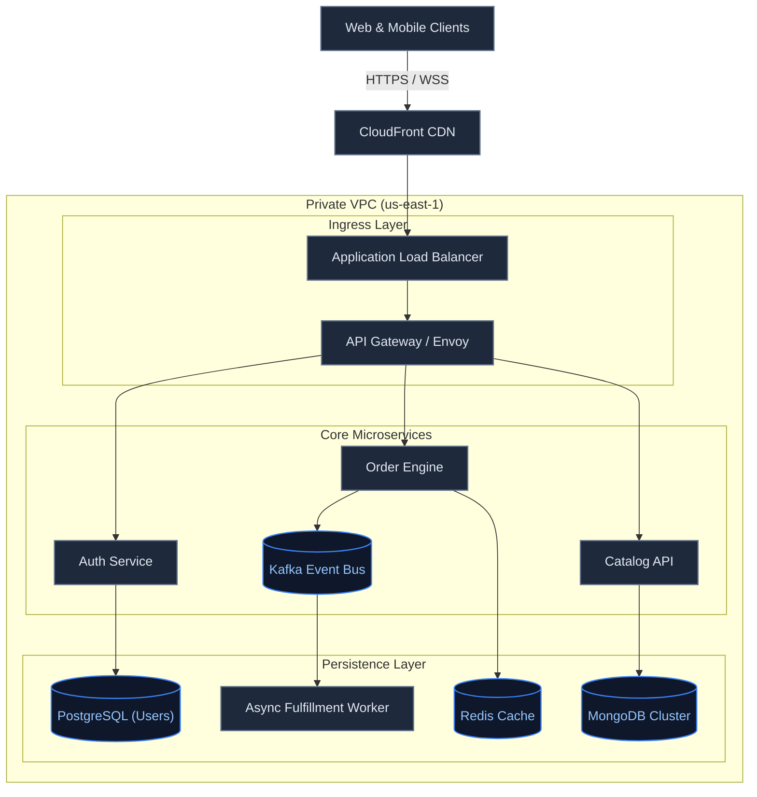
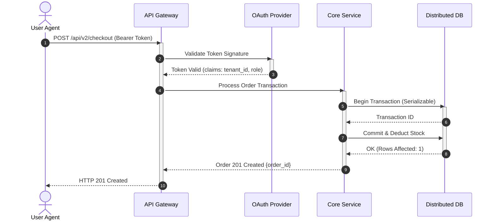
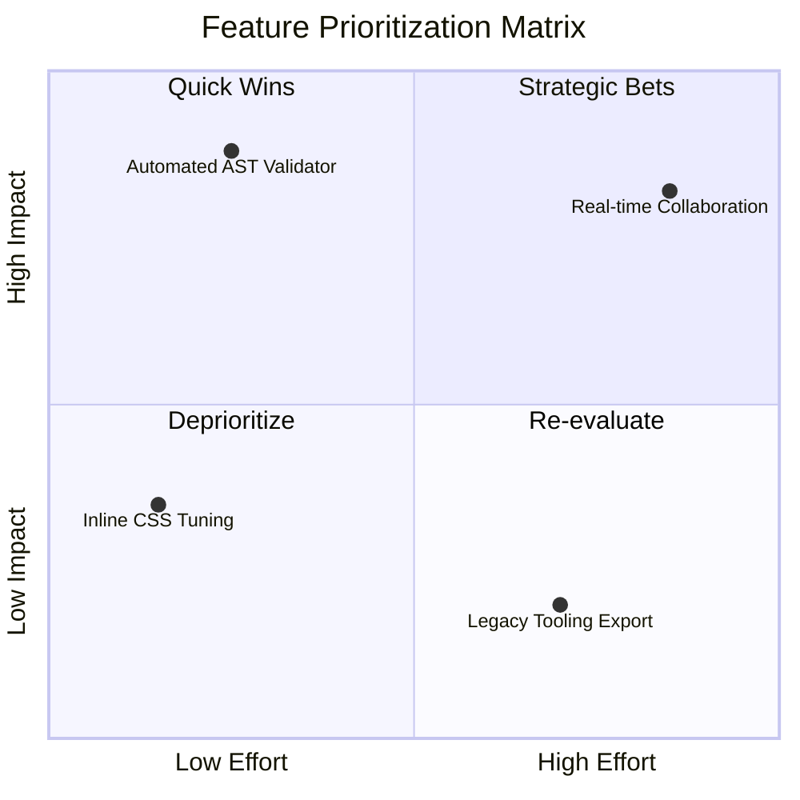
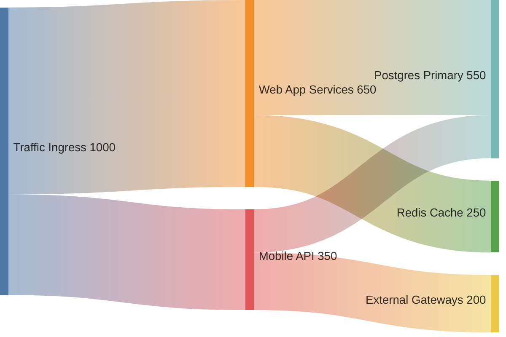

# Synaptix Diagram Architect Skill

Design publication-ready, mathematically sound, and syntax-safe Mermaid diagrams. Unlike static cheatsheets that leave syntax verification to chance, **Synaptix Diagram Architect** combines battle-tested structural rules with a **deterministic AST validator & auto-repair script** (`scripts/validate_mermaid.py`).

---

## When to Use This Skill

Activate this skill whenever the user or task involves:
- Diagramming system architectures, microservices, or cloud infrastructure
- Visualizing multi-agent workflows, state machines, or decision trees
- Illustrating sequence flows, API handshakes, and protocol timings
- Modeling entity relationships (ER), data pipelines, or ETL transformations
- Designing high-level executive roadmaps, Gantt timelines, or quadrant matrices
- Reviewing, debugging, or fixing a broken Mermaid diagram (`Syntax error in graph`, `Parse error`)

---

## The 8 Non-Negotiable Syntax Rules

Mermaid parsers are notoriously brittle. Adhere to these eight rules to prevent 99% of all parse errors:

### 1. Always Double-Quote Labels with Special Characters
Any label containing `( ) [ ] { } : ; / \ & < > # @ ! ? " '` **MUST** be wrapped in double quotes.


### 2. Never Use Reserved Keywords as Bare Node IDs
Mermaid reserves keywords such as `end`, `default`, `style`, `class`, `call`, `href`, `click`, and `subgraph`.
- **Bad:** `A --> end` *(conflicts with subgraph closing delimiter)*
- **Good:** `A --> end_node` or `A --> endNode["End of Process"]`

### 3. Comments Require Double Percent (`%%`)
A single `%` is a fatal syntax error. Always use `%%`:


### 4. Modern Keyword Header
Always use modern keywords on line 1:
- Prefer `flowchart TD` or `flowchart LR` over legacy `graph TD`.
- Use `sequenceDiagram`, `stateDiagram-v2`, `erDiagram`, `classDiagram`, `sankey-beta`, `quadrantChart`, `timeline`, or `block-beta`.

### 5. Prevent Subgraph Cross-Linking Deadlocks
Do not connect arrows directly to the `subgraph` ID if you are also connecting to its inner nodes. Always connect to the specific nodes inside:


### 6. Avoid Single Character `o` or `x` as Node IDs
Single characters `o`, `O`, `x`, or `X` trigger Mermaid's circle or cross-head edge decorators (`--o`, `--x`). Use descriptive IDs like `originNode` or `exitNode`.

### 7. Decision Diamonds: Keep Labels Concise
Diamond decision nodes (`{Decision?}`) should be short (1–4 words). Long labels blow out the width of the shape.


### 8. Strict Security Policy (No Scripting or External Hrefs)
Never emit `<script>`, `<iframe>`, `javascript:`, or `click ... href` handlers. These violate security sandboxes and trigger renderer rejection.

---

## Synaptix Design & Aesthetic Guidelines

1. **Directional Flow:**
   - **`flowchart TD` (Top-to-Down):** Use for hierarchical architectures, decision trees, and lifecycle stages.
   - **`flowchart LR` (Left-to-Right):** Use for pipelines, data streaming, message queues, and request-response cycles.
2. **Subgraphs as Logical Boundaries:**
   - Use `subgraph Name ["Clean Title"]` with double quotes for namespaces, security perimeters, VPCs, and database clusters.
3. **Edge Labels:**
   - Keep edge labels focused: `A -->|"POST /v1/auth"| B`. Wrap edge text in quotes if it contains symbols.

---

## Using the Validation & Repair Script

This skill bundles an executable companion script: [`scripts/validate_mermaid.py`](scripts/validate_mermaid.py).

### 1. Pre-Flight Validation
Verify your diagram DSL before returning it:
```bash
python3 scripts/validate_mermaid.py --code "flowchart TD
  A[\"Client\"] --> B[\"Gateway\"]
" --json
```

### 2. Automated One-Shot Syntax Repair
If an LLM or user provides a broken diagram (e.g. unquoted parentheses or bare `end` IDs), pass `--fix`:
```bash
python3 scripts/validate_mermaid.py --code "flowchart TD
  A[Step (1) Run] --> end --> B
" --fix
```
**Output:**


---

## Architectural Reference Patterns

### Pattern A: Modern Cloud Microservices Architecture


### Pattern B: Resilient Protocol Sequence


### Pattern C: Priority Matrix (Quadrant Chart)


### Pattern D: Multi-Stage Resource Flow (Sankey)


---

## Step-by-Step Execution Workflow

When tasked with creating or fixing a diagram:

1. **Synthesize Relationships:** Identify sources, targets, data payloads, and structural tiers.
2. **Select Diagram Type:**
   - Flowchart for architecture/pipeline.
   - Sequence for temporal request/response protocols.
   - State for finite-state models and life cycles.
   - Quadrant for 2x2 business matrices.
   - Sankey for resource/capacity distribution.
3. **Apply Escaping & Quoting:** Double-quote all text containing brackets, parentheses, colons, or punctuation.
4. **Run Pre-Check:** Test with `python3 scripts/validate_mermaid.py --code "..." --json` to ensure zero syntax or reserved word errors.
5. **Deliver Verbatim:** Deliver the cleaned code block enclosed in ````mermaid ... ````.
